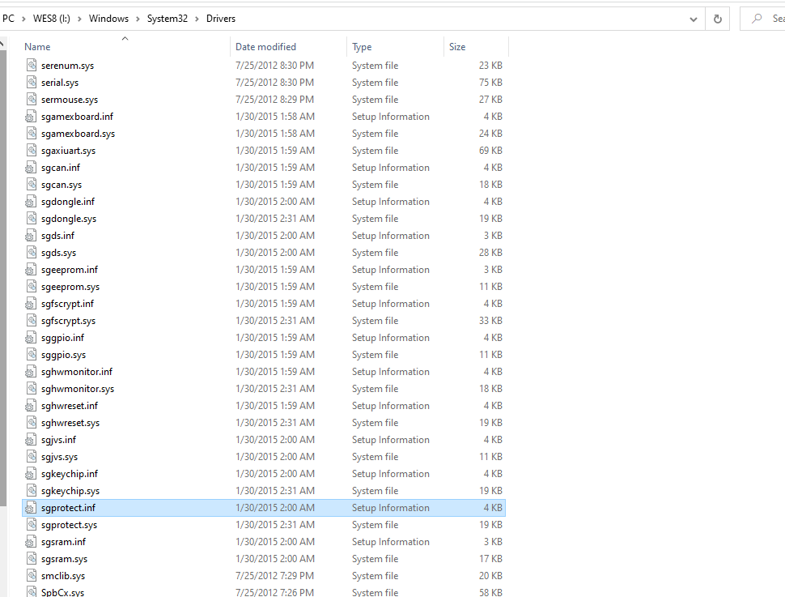

# Bitlocker
Sega Nu uses the USB keychip and Bitlocker to protect its storage. During investigation the main system drive has 1 bitlocker partitions protected by TPM and another one by external key.

### Encryption on System Disk
It appears that the system uses TPM for the system disks, and rest of the partition is using external keys which is stored on the system disk. There are two partition encrypted using bitlocker (/dev/sdb2, /dev/sdb3).

Extraction using bitlocker2john is not possible, DMA attack or TPM sniffing will be used to extract the FVEK.

### Encryption on Data Disk
The appears the data disk have 1 bitlocker encrypted partition, and two other normal partition. One of the normal parition appears to include some game data.

### Cracking bitlocker
It is known that cracking bitlocker and doing system dump is achieved before, but undocumented. I was able to defeat bitlocker using DMA attack, TPM sniffing involves too much variables and I did fail once before.

I have found this way is the most reliable and unlikely to brick the system or going into Bitlocker recovery mode.

1. Dump the full memory once the system is running, you do not need keychip, if system is at the error page, it will work as well.
2. Extract the bitlocker FVEK using [volatility framework](https://github.com/elceef/bitlocker)
3. Unlock the drive!

Here are couple things to keep in mind:

* Never change any BIOS setting, no boot order change, and no bitleaker (unreliable and one time attempt only)
* You are able to remove the AMEX (the JVS IO extension PCIe card) and not trigger bitlocker recovery
* You are able to remove the HDD+SDD and image them and test your decryption key without triggering bitlocker recovery. (make sure use read only mode)

For memory dumps, since the system is locked down really well, none of the keyboard shortcuts will work. [PCILeech](https://github.com/ufrisk/pcileech) is a way to use DMA attack and dump the memory. Plugging in [PCILeech](https://github.com/ufrisk/pcileech) will not trigger bitlocker recovery.

An example of extracted FVEK:

We can see all the SEGA drivers in the OS drive:

**Note**

DO NOT decrypt the disk and boot the arcade in normal mode, Nu's preboot has check that will render the device unusable once it detected the drives are decrypted. Keep the recovery key/encryption key and update files off the system.

**Note**

It is also possible to clone the entire system on to another system, there has been speculation that there are special software locks the disk to the motherboard serial, that is not true. You are able to take the encrypted raw disk image and take it to another system, during boot just enter the recovery key of the encrypted disk or re-key the boot partition to use the TPM on the motherboard.

**Re-key OS partition**

Once the encrypted image is restored to a different system, the bitlocker volume for the OS partition will continue try to use the previous system's TPM to unlock, this will end up failing everytime and prompt you to enter recovery key at every boot. You can re-key the drives by going into an Admin prompt and remove existing TPM key protector on the OS partition and add a new TPM key protector. After committing the changes using EWF, the system will be able to bootup without the need to enter recovery password