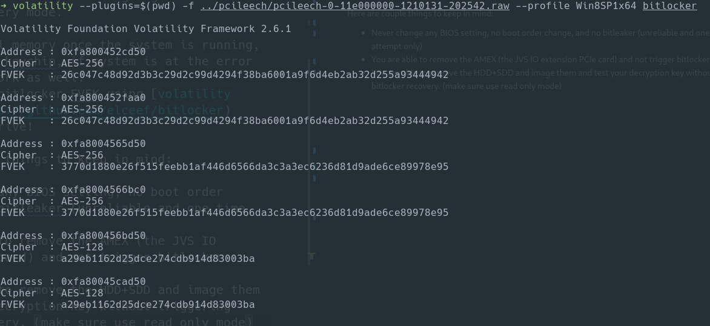

# Bitlocker
Sega Nu uses the USB key and Bitlocker to protect its storage. During investigation the main system drive has two bitlocker partitions protected by Startup Key + TPM.

### Encryption on System Disk
It appears that the system uses Startup Key + TPM for the system disks. There are two partition encrypted using bitlocker (/dev/sdb2, /dev/sdb3).

Credit: [petje](http://www.emuline.org/topic/1695-arcade-pc-chunithm-amazon-v130-omnimix-sega-nu-11/?do=findComment&comment=65867)

Extraction using bitlocker2john is not possible, DMA attack or TPM sniffing will be used to extract the FVEK.

### Encryption on Data Disk
The appears the data disk have 1 bitlocker encrypted partition, and two other normal partition. One of the normal parition appears to include some game data.

### Cracking bitlocker
It is know that cracking bitlocker and doing system dump is achieved before, but undocumented. I was able to defeat bitlocker using DMA attack, TPM sniffing involves too much variables and I did fail once before.

I have found this way is the most reliable and unlikely to brick the system or going into Bitlocker recovery mode.

1. Dump the full memory once the system is running, you do not need keychip, if system is at the error page, it will work as well.
2. Extract the bitlocker FVEK using [volatility framework](https://github.com/elceef/bitlocker)
3. Unlock the drive!

Here are couple things to keep in mind:

* Never change any BIOS setting, no boot order change, and no bitleaker (unreliable and one time attempt only)
* You are able to remove the AMEX (the JVS IO extension PCIe card) and not trigger bitlocker recovery
* You are able to remove the HDD+SDD and image them and test your decryption key without triggering bitlocker recovery. (make sure use read only mode)

For memory dumps, since the system is locked down really well, none of the keyboard shortcuts will work. [PCILeech](https://github.com/ufrisk/pcileech) is a way to use DMA attach and dump the memory. Plugging in [PCILeech](https://github.com/ufrisk/pcileech) will not trigger bitlocker recovery.

An example of extracted FVEK:

